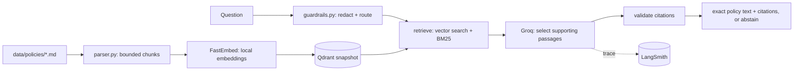

# Obbian RAG

Python/FastAPI service that answers Obbian rental-policy questions with exact-text citations. Groq selects supporting passages, FastEmbed generates local embeddings, Qdrant (embedded) stores them, and LangSmith traces every request. Managed with `uv`.

Called by `OBBIAN_BACKEND` — directly for `/api/policies/ask`, and as the `ask_policy` tool inside `/api/assistant`.

## Run

```sh
uv sync --frozen
cp .env.example .env   # set RAG_GROQ_API_KEY and RAG_API_KEY
uv run obbian-rag ingest
uv run uvicorn obbian_rag.api:create_app --factory --host 127.0.0.1 --port 8000
```

`RAG_PROVIDER=offline` (the `.env.example` default) needs no API key and is for tests only; production requires `RAG_PROVIDER=groq`.

## Architecture



Groq only *selects* which retrieved passages answer the question — it never authors policy text. The returned quote is always the source document's exact text.

## API

| Endpoint | Auth | Purpose |
|---|---|---|
| `POST /v1/answer` | Bearer `RAG_API_KEY` | Ask one policy question |
| `GET /health/ready` | none | Index readiness |
| `GET /v1/metrics` | Bearer `RAG_API_KEY` | Process-local counts |

Response: `{status, answer, citations[], request_id, index_version, mode, latency_ms, usage, trace_id}`. `status` is one of `answered`, `abstained`, `blocked`, `requires_backend`.

## Knowledge base

Six demo policies under `data/policies/` (cancellation, deposit, insurance, fuel/late return, payment, pickup), tracked with checksums in `data/manifest.json`. To add one: drop the file in, add its entry (id, version, path, SHA-256) to the manifest, then `uv run obbian-rag ingest`.

## Tests & evaluation

```sh
uv run pytest -q
uv run obbian-rag evaluate --split test --report reports/test.json
```

`evals/golden.jsonl` has 60 golden questions. Offline (`RAG_PROVIDER=offline`) runs check mechanics only — always re-run the eval against `RAG_PROVIDER=groq` before trusting a score.

## Deploy

Railway service `obbian-rag`, `Dockerfile`/`railway.toml` included. Required env: `RAG_ENVIRONMENT=production`, `RAG_PROVIDER=groq`, `RAG_GROQ_API_KEY`, `RAG_API_KEY` (32+ random chars), `RAG_GENERATION_MODEL=openai/gpt-oss-120b`, plus `LANGSMITH_API_KEY`/`LANGSMITH_PROJECT`/`LANGSMITH_TRACING=true` for tracing.

## Project map

```text
src/obbian_rag/
  api.py          FastAPI app, auth, rate limits, health
  config.py       Typed environment settings
  parser.py       Document parsing into bounded chunks
  index.py        Manifest validation, Qdrant snapshot
  providers.py    Groq generation + local embeddings (LangSmith-traced)
  guardrails.py   Redaction and request routing
  pipeline.py     Retrieval, evidence validation, answer assembly
  evaluate.py     Golden dataset runner
  cli.py          ingest / ask / evaluate commands
data/             Policy documents and manifest
evals/            Golden dataset
tests/            Unit, parser, index, API checks
```
