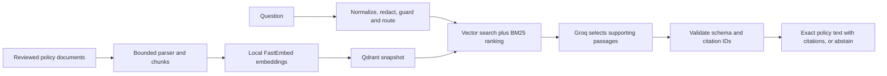

# Obbian RAG

A small, standalone Python service that answers Obbian rental-policy questions with citations. **Groq generates the evidence selection, FastEmbed generates local embeddings, Qdrant stores vectors, and FastAPI serves the API. Everything is managed with uv.**

The frontend and Node.js backend are deliberately **not connected** in this phase. This service cannot make reservations, check live availability, calculate live rental prices, or track vehicles. Those requests return `requires_backend` for a future integration to handle.

## Start here

You need **Python 3.12** and **uv**. If uv is not installed, follow [uv's installation guide](https://docs.astral.sh/uv/getting-started/installation/).

```sh
cd /Users/radhika/Desktop/OBBIAN_RAG
uv sync --frozen
cp .env.example .env
```

`uv sync --frozen` creates `.venv` and installs the exact versions in `uv.lock`. Do not edit the lockfile by hand. Do not overwrite `.env` if you already put a key there; add the missing settings instead.

### 1. Try it without any paid API

The example environment uses `RAG_PROVIDER=offline`. This deterministic test mode uses hashed word vectors and selects the top matching passage. It is **not** a semantic LLM replacement and can select irrelevant passages. Production startup rejects offline mode.

```sh
uv run obbian-rag ingest
uv run obbian-rag ask "What is the cancellation policy?"
uv run uvicorn obbian_rag.api:create_app --factory --host 127.0.0.1 --port 8000 --workers 1 --no-access-log
```

Open http://127.0.0.1:8000/docs. Click **Authorize** and enter the `RAG_API_KEY` value from `.env` to try `POST /v1/answer`.

### 2. Enable real Groq answers

Create an API key in the [Groq console](https://console.groq.com/keys). Set these in `.env`:

```dotenv
RAG_PROVIDER=groq
RAG_GROQ_API_KEY=your-groq-key
RAG_GENERATION_MODEL=llama-3.3-70b-versatile
RAG_EMBEDDING_MODEL=BAAI/bge-small-en-v1.5
RAG_DIMENSIONS=384
```

The generation provider is Groq. There is no OpenAI SDK, OpenAI key, or OpenAI embedding call. FastEmbed downloads an English BGE embedding model once and runs it locally on CPU. The cache needs writable disk and outbound access on first use.

Stop the service, then rebuild the index and restart:

```sh
uv run obbian-rag ingest
uv run obbian-rag ask "Are personal belongings covered by insurance?"
uv run uvicorn obbian_rag.api:create_app --factory --host 127.0.0.1 --port 8000 --workers 1 --no-access-log
```

Changing embedding mode/model/dimensions requires reindexing. The service detects incompatible indexes instead of silently mixing embeddings.

## How an answer is produced



1. Only manifest-listed, checksum-matching policy documents are indexed.
2. Documents are parsed in a subprocess with a timeout. Chunks retain document, version, and page/section metadata.
3. FastEmbed embeds the chunks; Qdrant stores vectors and metadata in a versioned local snapshot.
4. Incoming requests require a service bearer token. The service limits request size, request rate, and concurrent model calls.
5. Common instruction-injection patterns are blocked. Email addresses, phone-like numbers, and recognised API-key patterns are redacted before retrieval/generation. Live-action requests are routed away from policy answering.
6. Vector retrieval and BM25 ranking select candidates. Weak matches are discarded.
7. Groq receives the question and candidate passages as untrusted data. It returns a JSON object containing `sufficient` and `evidence_ids`.
8. Pydantic validates the JSON. IDs must refer to retrieved passages. Only those passages' exact text is returned, with citations. Missing evidence or invalid IDs produce an abstention.

**Why exact passages?** Rental fees, exceptions, and time limits should not be paraphrased incorrectly. This is a deliberately constrained, extractive RAG design. Groq selects evidence; application code formats the answer. It is less conversational than free-form generation, but cannot introduce model-authored fees or fabricated quotations. It can still choose an irrelevant or incomplete passage—evaluation and human review matter.

## What is in the knowledge base?

Six policy documents were copied from the existing backend's demo seed data:

| Topic | What the supplied policy actually says |
|---|---|
| Cancellation | Free more than 24 hours before pickup; 50% fee within 24 hours; no-show non-refundable |
| Security deposit | Released after inspection; allow 5–7 business days to the original payment account |
| Insurance | ₹249 demo option; eligible accidental damage, subject to agreement/excess; stated exclusions |
| Fuel and late return | Same fuel level; contact support before return time for an extension and charge confirmation |
| Payment | Check details; contact support with transaction reference for debit without a confirmed booking |
| Pickup | Valid licence and photo ID; inspect/document damage and confirm fuel level |

These are **demo policies**, not newly approved commercial/legal terms. The manifest's `approved` flag means accepted for this prototype corpus. A policy owner must review them before real customer use. The supplied policies do not specify an exact deposit amount, insurance excess, or hourly late fee; the model is instructed to abstain rather than invent them.

## API contract

| Endpoint | Authentication | Purpose |
|---|---|---|
| `GET /health/live` | None | Process liveness |
| `GET /health/ready` | None | Startup/index readiness, not a paid provider probe |
| `POST /v1/answer` | Bearer service key | Ask one policy question |
| `GET /v1/metrics` | Bearer service key | Process-local outcome counts |
| `/docs` | Development only | Interactive OpenAPI documentation |

Request:

```json
{"question":"What is the cancellation policy?"}
```

Example response shape:

```json
{
  "status": "answered",
  "answer": "Cancellations are free more than 24 hours before pickup. Within 24 hours, a 50% cancellation fee applies. A no-show is non-refundable. [1]",
  "citations": [{
    "document_id": "cancellation",
    "title": "Cancellation and refunds",
    "version": "Cancellation Policy v1.4",
    "source": "policies/cancellation.md",
    "locator": "document / Cancellation and refunds",
    "chunk_id": "stable-generated-id",
    "quote": "Cancellations are free more than 24 hours before pickup. Within 24 hours, a 50% cancellation fee applies. A no-show is non-refundable."
  }],
  "request_id": "generated-request-id",
  "index_version": "corpus-fingerprint",
  "mode": "groq",
  "latency_ms": 120
}
```

`latency_ms` above is illustrative, not a measured Groq result. Other statuses are `abstained`, `blocked`, and `requires_backend`. Expected non-answer outcomes return HTTP 200; authentication errors use 401, invalid inputs 422, oversized bodies 413, rate/capacity limits 429, and provider failures 503.

For future integration, the **Node backend** should call this API with a server-only bearer key. Do not put that key in `NEXT_PUBLIC_*` variables or call the protected service directly from a public browser. No CORS origins, backend routes, frontend files, or tool-calling integrations have been added here.

## Adding or changing documents

Supported: **Markdown, UTF-8 text, HTML, text-based PDF, DOCX paragraphs and tables**.

1. Put the reviewed document under `data/policies/`.
2. Add/update its entry in `data/manifest.json`: ID, title, version, relative path, SHA-256 checksum, status and effective date.
3. Compute its checksum with `uv run python -c "import hashlib,pathlib; print(hashlib.sha256(pathlib.Path('data/policies/fuel.md').read_bytes()).hexdigest())"`.
4. Keep one active version per policy ID. Remove superseded entries from the active manifest. Old snapshots remain on disk for controlled rollback.
5. Run `uv run obbian-rag ingest`, evaluate, then restart the service.

Parser limits: 10 MiB/file, 100 PDF pages, 500,000 extracted characters/document, 50 MiB expanded DOCX size, 2,000 ZIP entries, 20-second parser subprocess timeout, Linux parser memory cap. No remote URL fetching, uploaded files, macros, or code execution. Scanned/empty PDF pages fail with an OCR-needed message; OCR is deliberately not automatic. Complex PDF layouts can still extract in the wrong order—review extracted text. Overlong paragraphs fail rather than silently losing text.

Index builds use a lock and an atomic CURRENT pointer. Failed builds do not publish a partial index. Identical content/profile is idempotent. A running process retains its loaded snapshot until restart. Stop the local server before running a CLI command that opens the same Qdrant snapshot.

## Tests and golden evaluation

```sh
uv run ruff check src tests
uv run pytest -q
uv run obbian-rag ingest
uv run obbian-rag evaluate --split dev --report reports/dev.json --min-pass-rate 0
uv run obbian-rag evaluate --split test --report reports/test.json
```

`evals/golden.jsonl` has **60 synthetic golden cases**, split into 30 development and 30 regression-test questions. It covers supported policies, missing facts, out-of-scope questions, prompt injection and requests requiring live backend data. See [the dataset card](evals/DATASET_CARD.md).

Reports include per-case results, expected/actual status, citation correctness, required facts, retrieval recall@k, MRR, p95 latency, and verbatim grounding. The CLI exits nonzero below the default 90% pass gate. Do not tune prompts/thresholds on the test split. Phrase-based checks suit exact quotations, but are not an independent semantic judge.

Offline reports are diagnostics. Passing offline tests does not establish Groq quality. Run the same evaluation with `RAG_PROVIDER=groq` before release, inspect every unanswerable/adversarial failure, and obtain human sign-off for policy accuracy. CI never spends a provider key; it runs unit/API/parser tests and uploads a diagnostic offline report.

## Deploy on Railway

Use a **new service**, not the existing Obbian backend service. See [the deployment runbook](docs/DEPLOYMENT.md) for the complete steps.

The Dockerfile and `railway.toml` are included. Use one replica, one worker, and a persistent volume at `/data`. Set:

```dotenv
RAG_ENVIRONMENT=production
RAG_PROVIDER=groq
RAG_GROQ_API_KEY=your-groq-key
RAG_API_KEY=a-new-random-secret-of-at-least-32-characters
RAG_INDEX_DIR=/data/index
RAG_MODEL_CACHE_DIR=/data/models
RAG_BOOTSTRAP=true
```

Generate the service secret with `uv run python -c "import secrets; print(secrets.token_urlsafe(32))"`. Railway supplies `PORT`. Startup loads the embedding model and builds/reuses the index. The configured healthcheck is `/health/ready`.

This release targets a small policy corpus and one service process. Qdrant embedded mode and the rate limiter are not a multi-replica architecture. For scale, move Qdrant to a server and rate limits to shared storage. No public deployment is claimed until a Railway URL has been tested.

## Production limits and operations

- No guardrail is complete. Pattern-based injection and PII detection are partial protections, not a security or privacy guarantee. The strongest boundary is no tools and no model-authored policy text.
- Only English retrieval is configured. A multilingual UI needs a separately evaluated multilingual embedding model.
- No chat history or customer records are stored. Questions are redacted but still sent to Groq; review provider retention/account settings. Logs contain outcome, request ID, index version, and latency, not questions or keys.
- Sources themselves are trusted only after review; checksums prevent accidental changes, not a malicious manifest editor. Restrict repository write access.
- Readiness checks the local index, not ongoing Groq availability. Set external uptime/error alerts and a provider spending limit. In-memory metrics reset on restart.
- Provider calls have timeouts and one retry. High-latency model calls occupy a bounded concurrency slot. Use gateway request deadlines/body-read timeouts in deployment; the application is not a full DDoS defence.
- Dependency versions are locked, but model-weight artifacts are downloaded by FastEmbed. For stricter supply-chain controls, mirror and checksum approved model files before rollout.
- Keep at least the previous source revision and volume backup for rollback; reindex when policies or embedding configuration change.

## Project map

```text
src/obbian_rag/
  api.py          HTTP service, auth, limits, health and safe errors
  config.py       Typed environment configuration
  parser.py       Document parsing and bounded chunks
  index.py        Manifest validation and Qdrant snapshots
  providers.py    Groq generation, local embeddings, offline test provider
  guardrails.py   Normalisation, redaction and request routing
  pipeline.py     Retrieval, evidence validation, answer assembly
  evaluate.py     Golden dataset runner and reports
  cli.py          ingest / ask / evaluate commands
 data/            Policy source snapshot and manifest
 evals/           Golden dataset and its documentation
 tests/           Unit, parser, index and API checks
 docs/            Deployment and security runbooks
```

Official references: [Groq JSON outputs](https://console.groq.com/docs/structured-outputs), [FastEmbed models](https://qdrant.github.io/fastembed/examples/Supported_Models/), [Qdrant](https://qdrant.tech/documentation/), [Railway volumes](https://docs.railway.com/volumes), [Railway healthchecks](https://docs.railway.com/deployments/healthchecks).
